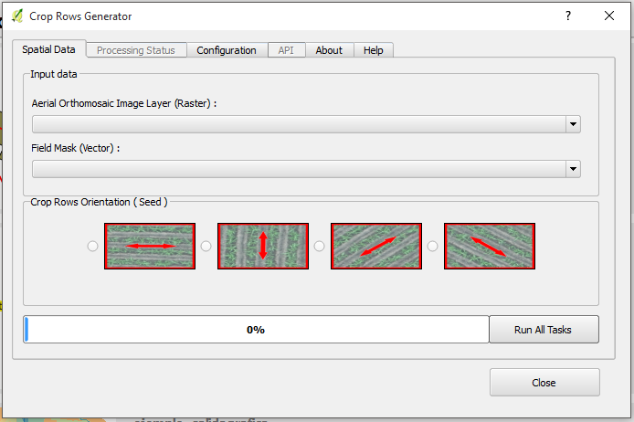
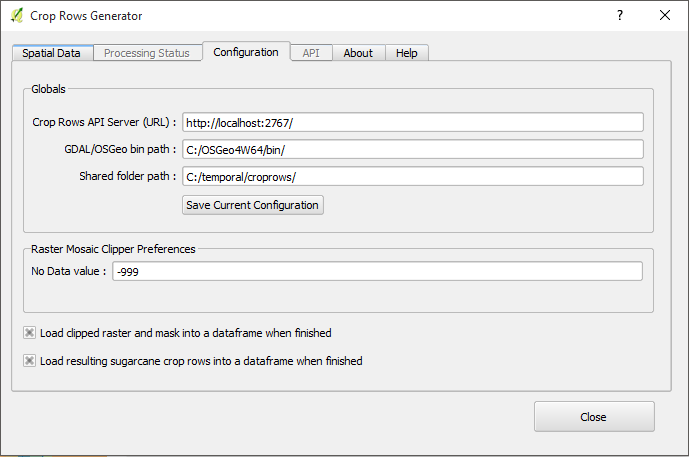
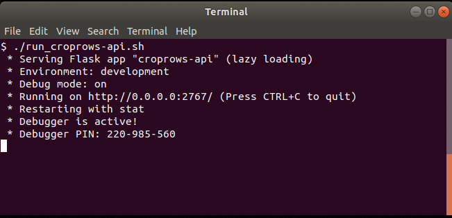
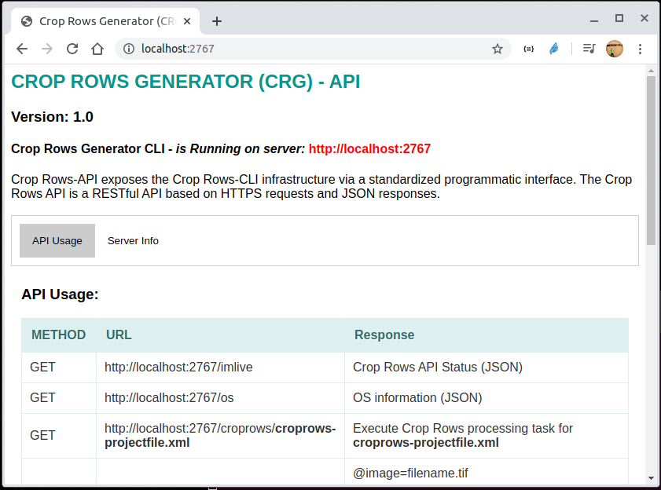
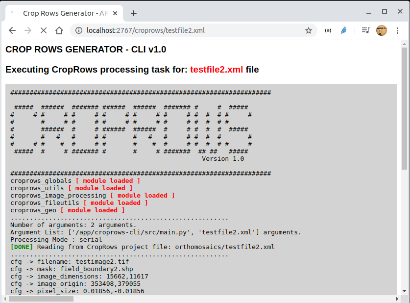
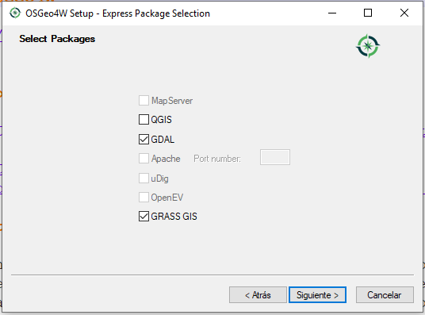

# croprows_generator_pa_v2

**croprows_generator_pa_v2** is the source code of **Crop Rows Generator v1.0 (CRG) - (Dockerized)**  updated to run under a Docker container.

**Crop Rows Generator (CRG) v1.0** is a tool that specialized user can use to generate georeferenced lines from high resolution images obtained by a drone. (CRG) uses an orthomosaic and a Field delimitation vector mask as an input. After processing CRG obtains at the output a set of Files that can be used to be integrated into geographic information systems or to be provided as an input for an auto-guidance machinery. (CRG) is based on computer vision techniques and under a high performance computing approach is capable of processing high resolution and large images and on these images detect, generate and mapping a crop rows in sugarcane Fields in an easy and accurate way,with a few clicks. CRG has a client interface (**CRG-QGIS Plugin**) integrated as a plugin into the geographic information system software (QGIS Desktop). A processing core that handles the most complex tasks and is accessed by a command line interface (**CRG-CLI** ). A REST API (CRG-API ) which exposes resources through on HTTP methods.

## Product Perspective

CRG was developed for everyone who is interested in generate geospatial crop rows in sugarcane Felds using high resolution imagery captured by a Drone. It is an open source project. It was developed to run on Linux O.S under a Docker container.

## Assumptions and Dependencies

The guide also assumes you have a working **Docker**  installation and a basic understanding of how a Dockerized application works.

## Resources

- Crop Rows Generator (CRG) v1.0 website:
http://34.222.36.64/croprowsgenerator/
- Crop Rows Generator (CRG) GitHub page:
https://github.com/AndresHerrera/croprows_generator_pa_v2
- Crop Rows Generator (CRG) Youtube Playlist:
https://www.youtube.com/playlist?list=PL5Uf6W3KZ2JBKwHgeifJJUgeGkOZviSIK

## Plugin for QGIS 2.x

[PACropRowsv1_QGIS2_x.zip](croprows-qgis-plugin/PACropRowsv1_QGIS2_x.zip)

## Plugin for QGIS 3.x

[PACropRowsv1_QGIS3_x.zip](croprows-qgis-plugin/PACropRowsv1_QGIS3_x.zip)

## Screenshots 

## Installation

### Clone repository

git clone https://github.com/AndresHerrera/croprows_generator_pa_v2.git

cd croprows_generator_pa_v2

### Build a "crg_v2" Docker image 

sudo docker build -t crg_v2:latest .

## Running crop rows generator api

sudo docker run --rm -p 2767:2767 --env FLASK_APP=croprows-api --env FLASK_ENV=development --env CRG_MODE=serial --name crg_v2 -v $(pwd)/droneimages:/app/orthomosaics crg_v2:latest

or just run 

sudo ./run_croprows-api.sh

### Accessing the CRG-CLI through CRG-API

* http://localhost:2767/

### Executing a crop rows generation task

* http://localhost:2767/croprows/croprows-projectfile.xml

## Download and Install OSGeo4W

- [OSGeo4W Web installer](http://download.osgeo.org/osgeo4w/osgeo4w-setup-x86_64.exe)

## QGIS Plugin Documentation

- [croprows-qgis-plugin](croprows-qgis-plugin/README.md)

## Developers Documentation

- [Crop Rows Generator - CLI](http://34.222.36.64/croprowsgenerator/crg_cli/html/index.html)

- [Crop Rows Generator - QGIS API](http://34.222.36.64/croprowsgenerator/crg_plugin/html/index.html)

## Performance Requirements

CRG requires a system with at least a 2.0 Megahertz CPU and 2 Gigabytes of RAM. However, these requirements can support efectively processing small crop field areas. Performance depends on the orthomosaic size and as a result, the system requirements for bigger orthomosaics are more demanding.

## License

croprows_generator_pa is free software; you can redistribute it and/or modify it under the terms of the GNU General Public License as published by the Free Software Foundation; either version 2 of the License, or (at your option) any later version.

* <em>Copyright (c) 2019-2020 Andres Herrera, Universidad del Valle</em>
